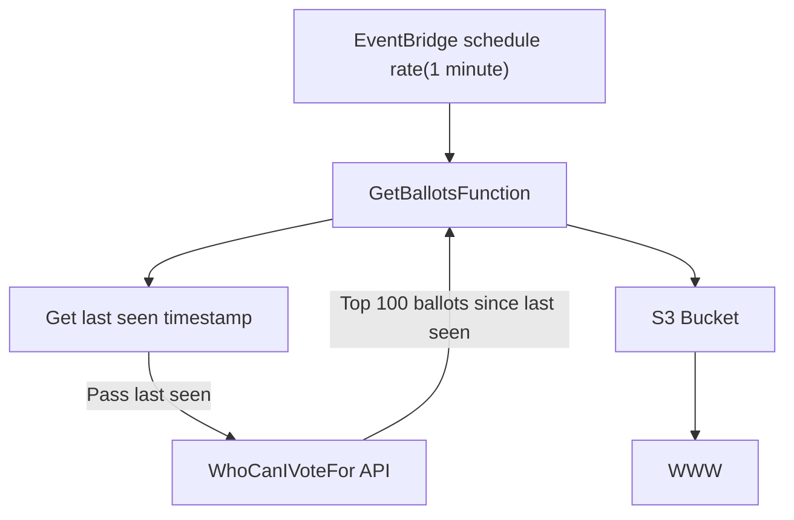

# BallotCacheWriter

Writes WhoCanIVoteFor ballots to an S3 bucket.

This project is deployed to AWS Lambda. It fetches data from WhoCanIVoteFor.
co.uk and writes it to an S3 bucket.



## Deployment

We use AWS SAM to deploy a CloudFormation stack that sets up the Lambda 
function and EventBridge rules

The S3 bucket needs to be manually created and passed in as a parameter 
store value `BALLOT_CACHE_S3_BUCKET=[bucket_name]`.

## Local development

If running locally files will be saved to a `ballot_data` directory.

To run:

```shell

python ballot_writer/get_ballots.py
```
